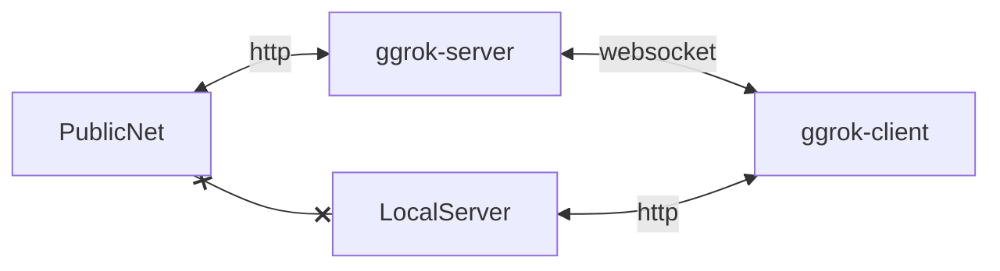

# Architecture

This document describes the high-level architecture of ggrok. If you want to familiarize yourself with the code base, you are just in the right place!

## Bird's Eye View

On the highest level, ggrok is a thing that exposes your local server to the internet, so that others can visit your local server easily.